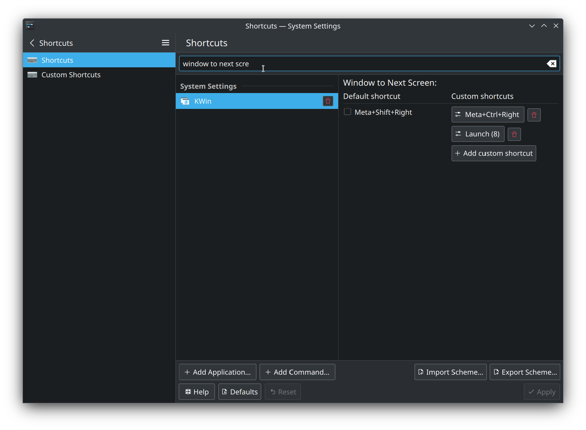

<!--lint disable list-item-indent-->
<!--lint disable list-item-bullet-indent-->

# Setup
here i will collect all information about what scripts or tools to use
to get to a nice working overall experience...

## graphics
currently i use the proprietary nvidia drivers.
to get the newest version have a look at the [graphics-drivers ppa](https://launchpad.net/~graphics-drivers/+archive/ubuntu/ppa)
a good read is [this askubuntu answer](https://askubuntu.com/a/61433/207905).

## screen brightness
for now i use [ICC Brightness](https://github.com/udifuchs/icc-brightness)
for me this works on the main screen only.
for additional info have a look at [issue #1 - screen brightness](https://github.com/s-light/ASUS-ZenBook-Pro-Duo-UX581GV/issues/1)

## touch & pen input

copy config

```bash
sudo cp 99-touch_pen_input.conf /usr/share/X11/xorg.conf.d/
```

this setups the touchscreens to work on there own screen-area.
and setups the pen input to be handled by the wacom / Graphic-Tablet driver.
the IDs are [submitted to the libwacom team](https://github.com/linuxwacom/libwacom/pull/186).
but it can take some time till it lands in the official packages...
if you want to try directly copy the two files
- [elan-29b6.tablet](https://github.com/s-light/libwacom/blob/ASUS_ZenBook_Pro_Duo/data/elan-29b6.tablet)
- [elan-29a1.tablet](https://github.com/s-light/libwacom/blob/ASUS_ZenBook_Pro_Duo/data/elan-29a1.tablet)
to `/usr/share/libwacom/` as [described in the wiki](https://github.com/linuxwacom/libwacom/wiki#data-files)

### enable multitouch input in firefox

```bash
$ echo -e "\n# setup firefox multitouch \nMOZ_USE_XINPUT2=1\n" >> ~/.profile
```
> if enabled the content will not scroll with a mouse-wheel on 'not active' windows..
> this is a known limitation/bug.

### application window screen moving

for KDE you don't need any fancy tools for the window screen management:
it offers keyboard options to move the current window from one to the other screen.
i have added the 'toggle screen' key to Window to next Screen
this results in toggle if only the two screens are active - 
and moves the window through all screens if an 3 external screen is attached...



i don't know if gnome has similar things out of the box.. 